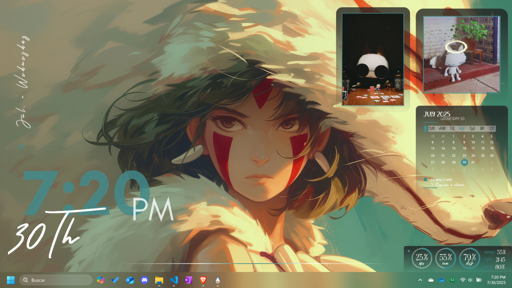
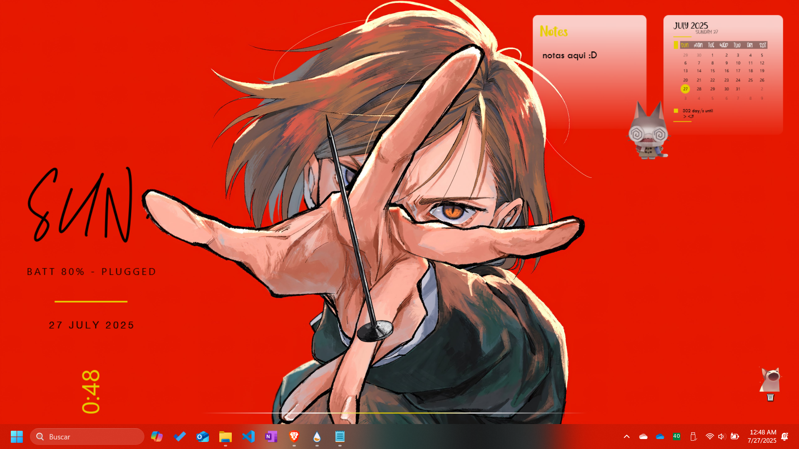
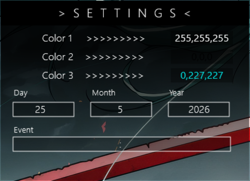

# Rainmeter Skin Pack

## Descripción

Este repositorio contiene un paquete de skins para [Rainmeter](https://www.rainmeter.net/) que he modificado con el objetivo de unificar su estética y funcionalidad.  
  
`La versión actual aún se encuentra en desarrollo y representa una versión primitiva o temprana del proyecto. Se irán añadiendo mejoras y nuevas funcionalidades en futuras actualizaciones.`
  

> ⚠️ **Importante:** Estas *no son creaciones originales*, sino adaptaciones de skins ya existentes, realizadas únicamente con fines de organización, personalización visual y mejora de la experiencia de usuario.

---

## Ejemplos Visuales

  
  
   
  
  

---

## Reconocimiento a Autores Originales

Estas modificaciones no habrían sido posibles sin los trabajos publicados por los respectivos creadores de cada tema:

| Skin | Autor | Enlace |
|--------|----------|-----------|
| **Sonder Rainmeter Theme** | Connect-R | [VisualSkins](https://visualskins.com/skin/sonder) |
| **Aries Pack** | Aiden.Jair | [DeviantArt](https://www.deviantart.com/aidendrew/art/Aries-Pack-903982509) |
| **Ahri Pack 1.0** | ijoemski | [DeviantArt](https://www.deviantart.com/ijoemski/art/Ahri-Pack-1-0-375008587) |
| **Cantarell** | ApexXx-SenSei | [DeviantArt](https://www.deviantart.com/apexxx-sensei/art/Cantarell-770482237) |

> Todos los derechos sobre los diseños originales pertenecen exclusivamente a sus respectivos autores.  
> Esta recopilación y modificación es de carácter personal y sin fines comerciales.

---

## Instalación

1. Descarga e instala [Rainmeter](https://www.rainmeter.net/).
2. Descarga el archivo [`customDesktop_1.0.rmskin`](./customDesktop_1.0.rmskin).
3. Haz doble clic sobre el archivo `.rmskin` para instalarlo con el instalador de Rainmeter.
4. Activa las skins desde el **Rainmeter Manager**.
5. Ajusta a tu gusto desde la interfaz o el código `.ini`.

---

## Notas Finales

- Puedes mover, modificar o desactivar cualquier módulo desde el panel de control de Rainmeter.
- Si algún autor original desea que su trabajo sea removido de este paquete, por favor contáctame.
