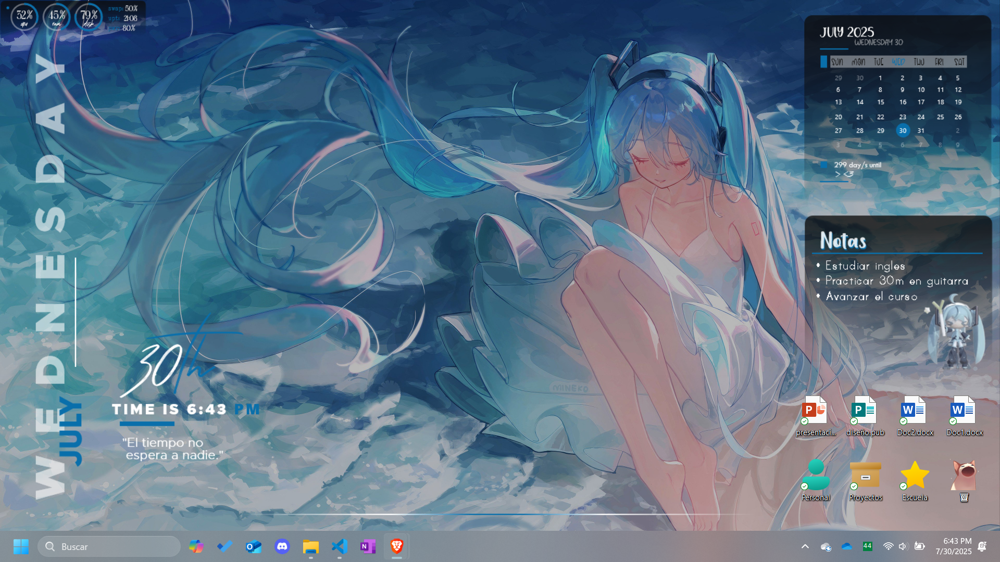
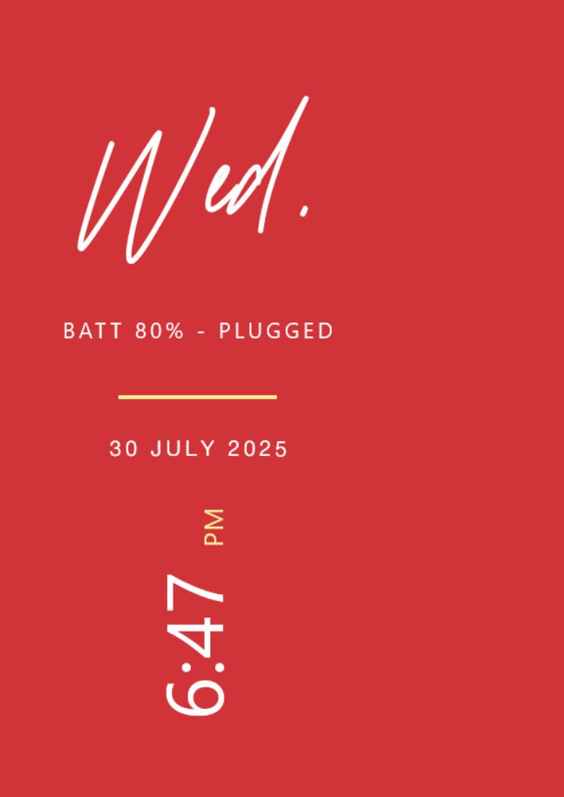
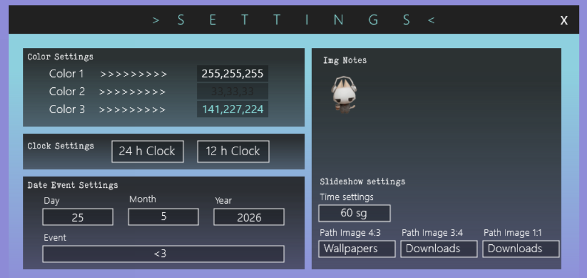

# Venuz Rainmeter Skin Pack

## Descripción

**Venuz** es un completo paquete de skins para [Rainmeter](https://www.rainmeter.net/), diseñado para ofrecer una experiencia visual armónica, funcional y altamente personalizable en escritorios con Windows.  
Este proyecto unifica, adapta y mejora diversos módulos de skins existentes, integrándolos en una sola interfaz coherente y estética.

> La versión actual es funcional y se considera estable. Sin embargo, el proyecto sigue abierto a mejoras, nuevas funcionalidades y sugerencias.

---

## Funcionalidades Principales

### Relojes Digitales (7 estilos)

Widgets de reloj en distintos estilos visuales y tamaños, ideales para diferentes distribuciones del escritorio.

  
  
   
  
  
  
   
  
  

---

### Calendario

Un calendario compacto y moderno para visualizar rápidamente fechas importantes.

---

### Notas

Módulo sencillo para tomar notas rápidas desde el escritorio.

---

### Slideshow Personalizable (3 formatos)

Reproductores de imágenes en formato 1:1, 4:3 y 3:4, con selección de carpetas desde el panel de configuración.

  

---

### Visualizador de Sonido

Visualizador dinámico de audio compatible con reproductores populares como Spotify, AIMP o el Reproductor de Windows.

---

### Barra de Sistema

Una barra superior (o inferior) con widgets de información del sistema: batería, CPU, RAM, red, volumen, almacenamiento, etc.

---

### Panel de Configuración Centralizado

Panel visual para configurar los siguientes aspectos sin necesidad de editar los archivos manualmente:

- Colores principales
- Rutas de carpetas (slideshow)
- Formato de hora
- Fecha de evento destacado
- Icono visible en notas

  

---

## Ejemplos de Acomodo Visual

Visualiza cómo puede organizarse el pack en distintos entornos:

  
  

---

## Recursos Incluidos

- **Fuentes personalizadas** en la carpeta `Fonts/`.
- **Scripts en PowerShell** para selección visual de carpetas.
- **Archivos de configuración** `.ini`, `.inc`, `.lua` estructurados para fácil personalización.

---

## Instalación

1. Descarga e instala [Rainmeter](https://www.rainmeter.net/).
2. Descarga el archivo de la versión mas reciente.
3. Ejecuta el archivo y sigue el instalador automático.
4. Activa las skins desde el **Rainmeter Manager**.
5. Personaliza desde la interfaz de configuración.

---

## Reconocimiento a Autores Originales

Este pack es una adaptación de skins de distintos autores. Todos los créditos son para sus respectivos creadores:

| Skin | Autor | Enlace Original |
|------|-------|-----------------|
| **Sonder Rainmeter Theme** | Connect-R | [VisualSkins](https://visualskins.com/skin/sonder) |
| **Aries Pack** | Aiden.Jair | [DeviantArt](https://www.deviantart.com/aidendrew/art/Aries-Pack-903982509) |
| **Ahri Pack 1.0** | ijoemski | [DeviantArt](https://www.deviantart.com/ijoemski/art/Ahri-Pack-1-0-375008587) |
| **Cantarell** | ApexXx-SenSei | [DeviantArt](https://www.deviantart.com/apexxx-sensei/art/Cantarell-770482237) |
| **July Flat'ish 2.0** | evertonstz | [DeviantArt](https://www.deviantart.com/evertonstz/art/July-Flat-ish-2-0-429262245) |

> Este pack no tiene fines comerciales. Si algún autor desea que su contenido sea removido, puede comunicarse directamente a través de este repositorio.

---

## Notas Finales

- Puedes mover, modificar o desactivar cualquier módulo desde el panel de Rainmeter.
- Los usuarios pueden crear fácilmente sus propios temas personalizados con los componentes incluidos.

